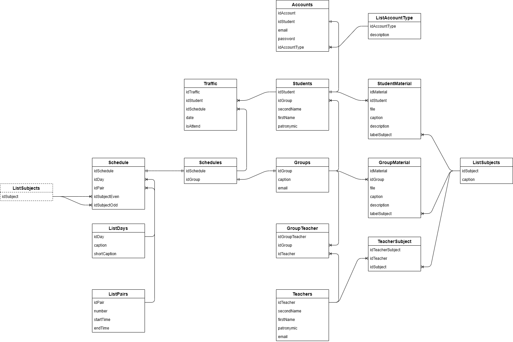
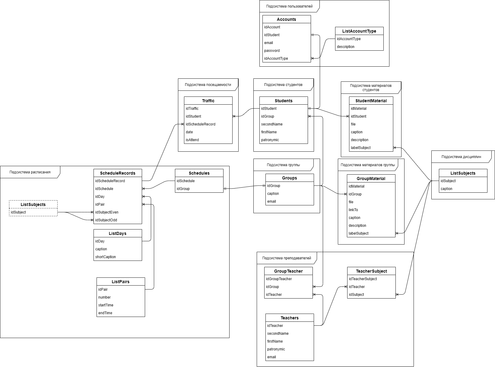

# Схема базы данных

В данном разделе описаны таблицы базы данных.

Основные соглашения по наименованию таблиц и столбцов:

- Таблицы с именами List* - это списки, значения в которых либо не изменяются, либо изменяются достаточно редко
- Таблицы с сочетанием имён, например, GroupTeacher - это таблицы, реализующие связь многие ко многим
- Все столбцы именуются в верблюжьем стиле, например idTeacher, lastUpdate и т.д.

## Логическая схема (без подсистем)

Логическая схема без обозначения подсистем представлена на рисунке ниже.

## Логическая схема (с подсистемами)

Логическая схема с обозначением подсистем представлена на рисунке ниже.

